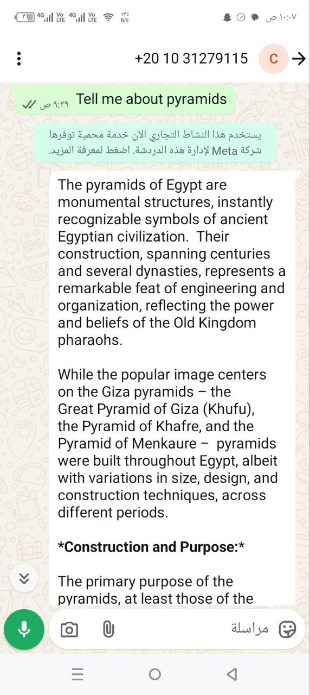
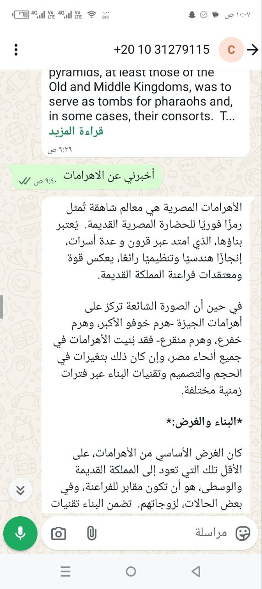
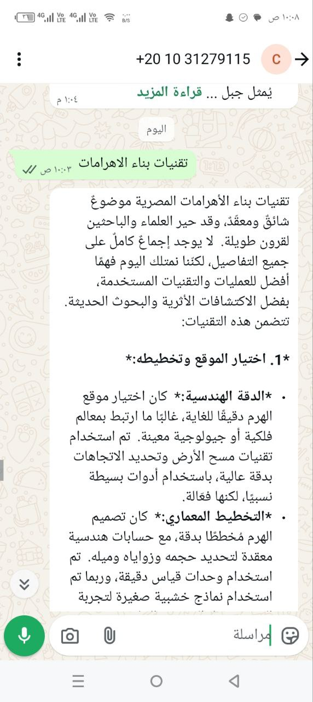
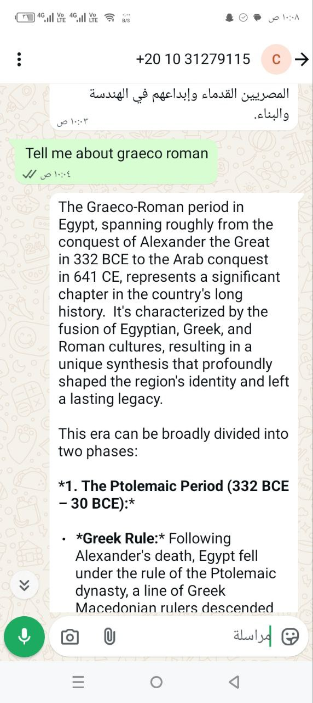
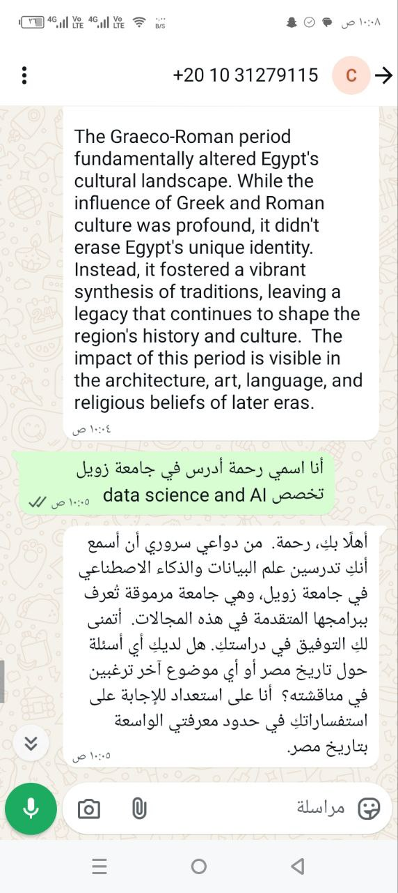
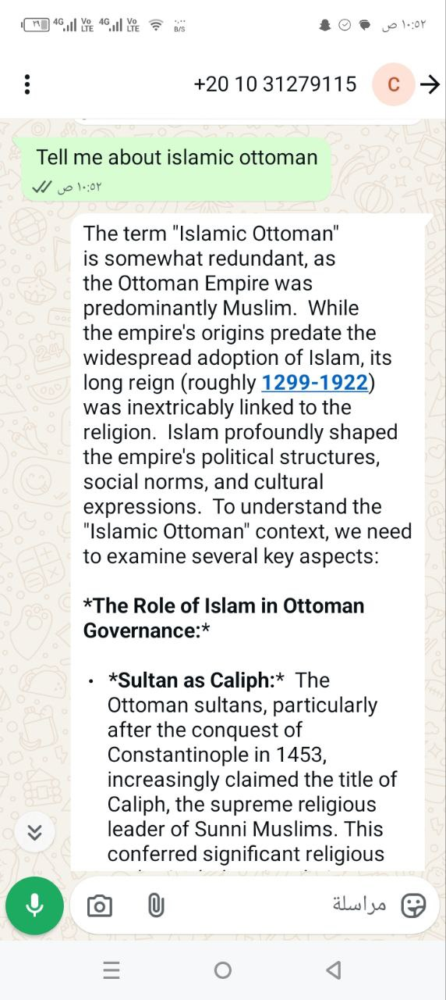

# Chronicler of the Nile - WhatsApp Chatbot

A sophisticated AI chatbot that embodies the vast knowledge of Egyptian history, integrated with WhatsApp Cloud API and enhanced with Wikipedia search functionality.
## first you can test my chatbot by send a message to this phone number:01031279115

### Features

- **WhatsApp Integration**: Responds to messages sent to  WhatsApp Business number
- **Wikipedia Enhancement**: Uses Wikipedia search chains to provide accurate historical information
- **Multi-language Support**: Supports your  language
- **Egyptian History Expertise**: Specialized knowledge spanning all periods of Egyptian history
- **Conversation Memory**: Maintains context across conversations


###  Environment Variables

Update the `.env` file with your credentials:

```
WHATSAPP_ACCESS_TOKEN=your_access_token
WHATSAPP_PHONE_NUMBER_ID=your_phone_number_id
WHATSAPP_VERIFY_TOKEN=your_verify_token
WHATSAPP_APP_SECRET=your_app_secret
GEMINI_API_KEY=your_gemini_api_key
```

### Conversation Management

- **Max Conversation Tokens**: 4000 (context window management)
- **Max History Length**: 50 messages per session
- **Session Timeout**: No automatic timeout (persistent until cleared)

## Development

### Project Structure
```
chronicler_of_the_nile/
├── backend/
│   ├── src/
│   │   ├── models/
│   │   │   └── conversation.py
            └── user.py
│   │   ├── routes/
│   │   │   ├── chat.py
│   │   │   └── knowledge.py
            └── user.py 
            └── whatsapp.py
        
│   │   ├── static/
│   │   │   └── index.html
        
│   │   ├── utils/
│   │   │   └── wikipedia_search.py
        ├── __init__.py
│   │   ├── config.py
│   │   └── main.py
│   ├── requirements.txt
│   └── venv/
├── frontend/
│   ├── src/
│   │   ├── components/
│   │   │   └── ui/
│   │   ├── App.jsx
│   │   ├── App.css
│   │   └── main.jsx
│   ├── package.json
│   └── node_modules/
├── knowledge_base/
│   ├── ancient_egypt.json
│   ├── graeco_roman.json
│   ├── islamic_ottoman.json
│   └── modern_egypt.json
├── README.md
└── GHANGELOG.md
```

### Adding New Historical Periods

1.  new JSON file in `knowledge_base/`
2. Follow the existing structure with period, timeframe, overview, etc.
3. Update the knowledge route to include the new period
4. Test the API endpoints

## Historical Periods Covered

### 1. Ancient Egypt (c. 3100 BCE - 30 BCE)
- Early Dynastic Period
- Old Kingdom (Pyramid Age)
- Middle Kingdom
- New Kingdom (Egyptian Empire)
- Late Period
- Pharaohs, gods, monuments, and daily life

### 2. Graeco-Roman Egypt (332 BCE - 641 CE)
- Ptolemaic Dynasty
- Roman Province
- Alexandria as center of learning
- Rise of Christianity
- Intellectual achievements

### 3. Islamic and Ottoman Egypt (641 CE - 1805 CE)
- Arab Conquest
- Fatimid Caliphate
- Ayyubid Dynasty
- Mamluk Sultanate
- Ottoman Period
- Cultural and religious developments

### 4. Modern Egypt (1805 CE - Present)
- Muhammad Ali Dynasty
- British Occupation
- Independence and Revolution
- Nasser, Sadat, and Mubarak eras
- Arab Spring and contemporary Egypt

### 3. Local Development : if you don't want publish this bot 

```bash
# Install dependencies
pip install -r requirements.txt

# Initialize database
python init_db.py

# Run the application
python src/main.py
```

### 4. Deployment Options

###  Vercel 

1. **Install Vercel CLI**
   ```bash
   npm install -g vercel
   ```

2. **Create vercel.json**
   ```json
   {
     "version": 2,
     "builds": [
       {
         "src": "src/main.py",
         "use": "@vercel/python"
       }
     ],
     "routes": [
       {
         "src": "/(.*)",
         "dest": "src/main.py"
       }
     ]
   }
   ```

3. **Deploy**
   ```bash
   vercel --prod
   ```


### Step 1: Facebook Developer Account
1. Go to [developers.facebook.com](https://developers.facebook.com)
2. Create a new app
3. Add "WhatsApp Business API" product

### Step 2: Get Credentials
- **Access Token**: From WhatsApp → API Setup
- **Phone Number ID**: From WhatsApp → API Setup  
- **Verify Token**: Create your own 
- **App Secret**: From App Settings → Basic

### Step 3: Configure Webhook
1. In WhatsApp → Configuration
2. Set Webhook URL: `https://your-deployed-app.com/whatsapp/webhook`
3. Set Verify Token
4. Subscribe to `messages` events

### Step 4: Add Phone Number
1. Go to WhatsApp → Phone Numbers
2. Add your phone number
3. Verify the number

## Testing Your Deployment

1. **Check Status**
   ```bash
   curl https://your-app.com/whatsapp/status
   ```

2. **Test Webhook**
   ```bash
   curl -X GET "https://your-app.com/whatsapp/webhook?hub.mode=subscribe&hub.challenge=test&hub.verify_token="set_yourverify"
   ```

3. **Send Test Message**
   Send a WhatsApp message to your business number and check for responses.


#### Option B: Docker
```bash
docker build -t chronicler-nile .
docker run -p 5000:5000 chronicler-nile
```


## Usage

Once deployed and configured, users can:

1. Send messages to your WhatsApp Business number
2. Ask questions about Egyptian history in English or Arabic
3. Receive detailed, contextual responses enhanced with Wikipedia information

## Example Conversations

**English:**
- User: "Tell me about Cleopatra"
- Bot: Provides detailed information about Cleopatra with Wikipedia context

**Arabic:**
- User: "أخبرني عن الأهرامات"
- Bot: يقدم معلومات مفصلة عن الأهرامات مع السياق من ويكيبيديا
## Example WhatsApp Chat















---

*The Chronicler of the Nile - Bringing Egyptian history to life through AI*
